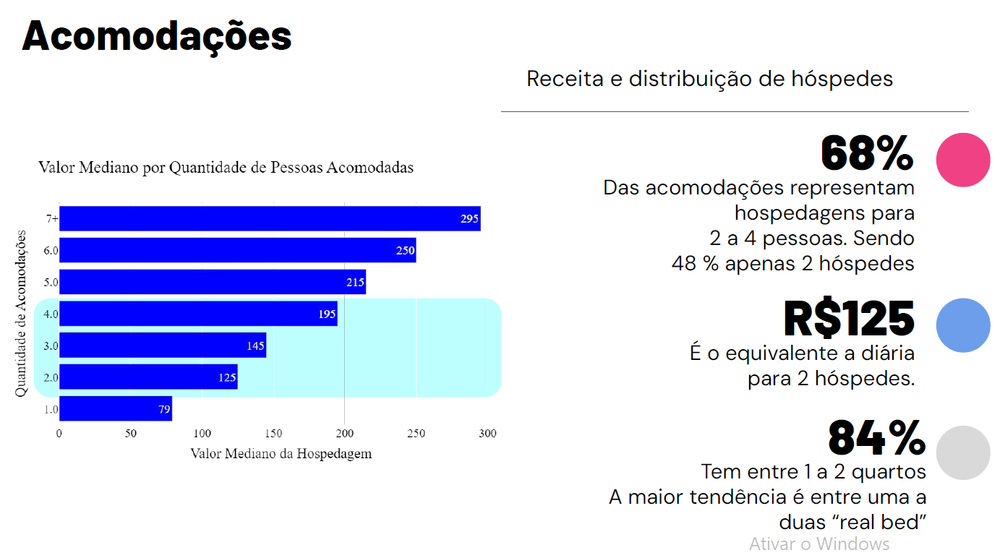
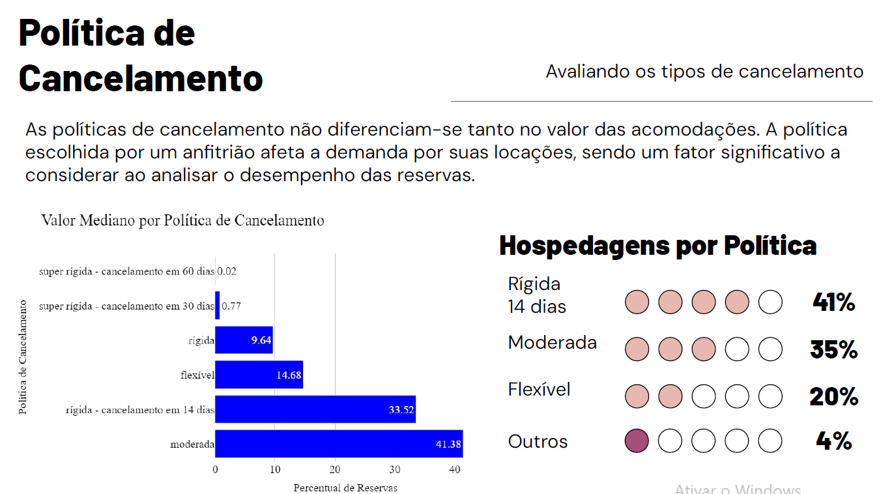
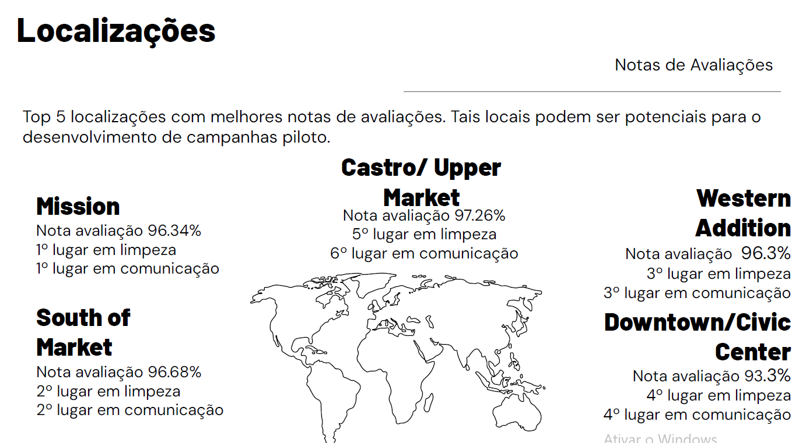
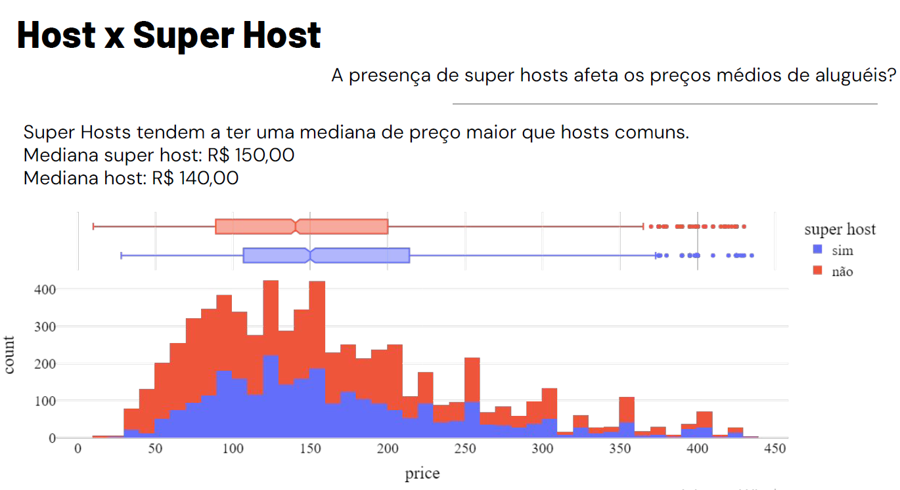
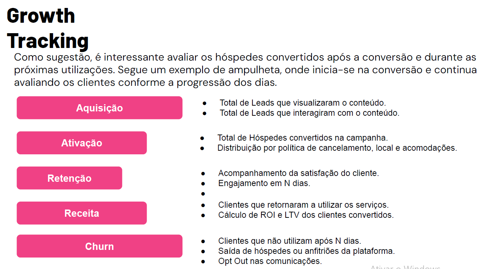

# **Airbnb Data Analysis**
by Victor Hugo Rocha de Oliveira

# **Airbnb Data Analysis: Growth Strategies**

Welcome to my Airbnb Data Analysis project, where we dive into the world of Airbnb to develop innovative growth strategies that will elevate your property's performance and maximize your revenue. With a focus on data-driven insights, this project aims to provide actionable recommendations for Airbnb hosts looking to thrive in the competitive vacation rental market.

## **Project Objectives**

- **Uncover Insights**: Identify hidden patterns and trends within Airbnb data that can significantly impact financial performance and property occupancy.
- **Statistical Analysis**: Utilize statistical techniques to evaluate the effectiveness of various growth strategies and determine their potential impact on your property's success.
- **Strategic Recommendations**: Develop practical recommendations for Airbnb hosts based on the insights derived from the analysis, empowering hosts to make informed decisions to optimize their revenues and increase property occupancy.

## **Project Presentation**
To gain deeper insights into the project findings and growth strategies, please explore the comprehensive presentation:
[View Presentation](reports/Airbnb_Growth_Strategies_Presentation.pdf)

## **Exploratory Data Analysis (EDA)**
Explore the insights derived from our Exploratory Data Analysis:

- Visualize the [EDA](reports/apresentacao%20da%20analise%20-%20airbnb-growth-strategies.pdf)

### **Accommodation Insights**
Unlock the potential of your property with insights into accommodation value per number of guests and revenue distribution:

### **Cancellation Policies**
Gain an understanding of the impact of different cancellation policies on booking trends and property performance:

### **Locations Analysis**
Explore the geographical distribution of Airbnb listings and identify high-demand areas for property investment:

### **Host vs. Superhost**
Analyze the performance difference between regular hosts and superhosts to understand the benefits of achieving superhost status:

### **Growth Strategies**
Explore recommendations based on growth to develop and analyze marketing strategies:

## **Project Organization**
------------

    ├── README.md          <- The top-level README for developers using this project.
    ├── data
    │   ├── processed      <- The final, canonical data sets for modeling.
    │   └── raw            <- The original, immutable data dump.
    │
    ├── references         <- Data dictionaries, manuals, and all other explanatory materials.
    │
    ├── reports            <- Generated analysis as HTML, PDF, LaTeX, etc.
    │   ├── figures        <- Generated graphics and figures to be used in reporting
    │   └── Airbnb_Growth_Strategies_Presentation.pdf <- Presentation containing key findings and growth tests.
    │
    ├── requirements.txt   <- The requirements file for reproducing the analysis environment, e.g.
    │                         generated with `pip freeze > requirements.txt`
    │
    ├── src                <- Source code for use in this project.
    │   ├── __init__.py    <- Makes src a Python module
    │   │
    │   ├── Notebook EDA   <- Exploratory Data Analysis